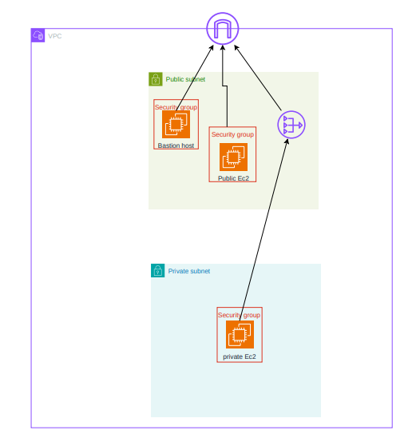

# Module to Provision EC2 with Terraform

This Terraform module provisions the following resources on AWS:

- A private subnet in each availability zone in the default VPC.
- One NAT Gateway in the default VPC, with routing configured for private subnets to allow egress traffic through the NAT Gateway.
- One EC2 instance (Amazon Linux 2) in a private subnet (t2.micro).
- One Bastion host (Amazon Linux 2) in a public subnet (t2.micro).

## Prerequisites

Before you begin, ensure you have the following:

- Terraform installed on your local machine.
- AWS credentials configured on your local machine.

## Usage

To provision the EC2 instances and associated resources using this module on AWS, follow these steps:

1. Initialize the Terraform configuration:
    ```sh
    terraform init
    ```

2. Apply the Terraform configuration:
    ```sh
    terraform apply
    ```

3. To destroy all your provisioned resources, run:
    ```sh
    terraform destroy 
    ```

## Diagram for EC2 with Terraform



## Accessing the Instances

### Accessing the Bastion Host

To access the Bastion host, run the following command:
```sh
    ssh -i ~/Downloads/radwan-key.pem -L 2222:172.31.100.168:22 ec2-user@44.192.34.134
```
### Accessing the Private Instance

In another terminal, run the following command to access the private instance through the SSH tunnel
```sh
    ssh -i ~/Downloads/radwan-key.pem -p 2222 ec2-user@localhost
```

## Outputs
The module provides the following outputs:

- ec2_private_instance_id: The ID of the private EC2 instance.
- ec2_private_instance_private_ip: The private IP address of the private EC2 instance.
- security_group_id: The ID of the security group.
- security_group_name: The name of the security group.

## Notes
- The EC2 instance is accessible on the AWS Console using SSM Session Manager.
- SSH keys are kept local and are not copied to the Bastion Host.
- The AMI is not hard-coded; the latest Amazon Linux 2 AMI in the region is used via a Terraform data source.